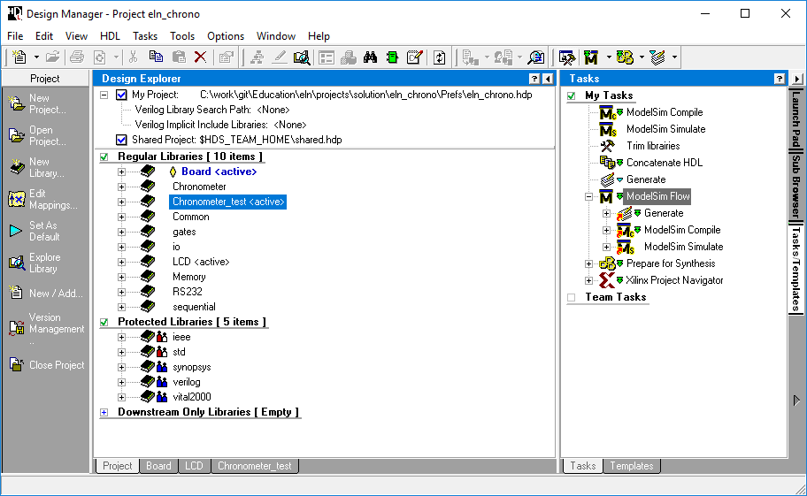
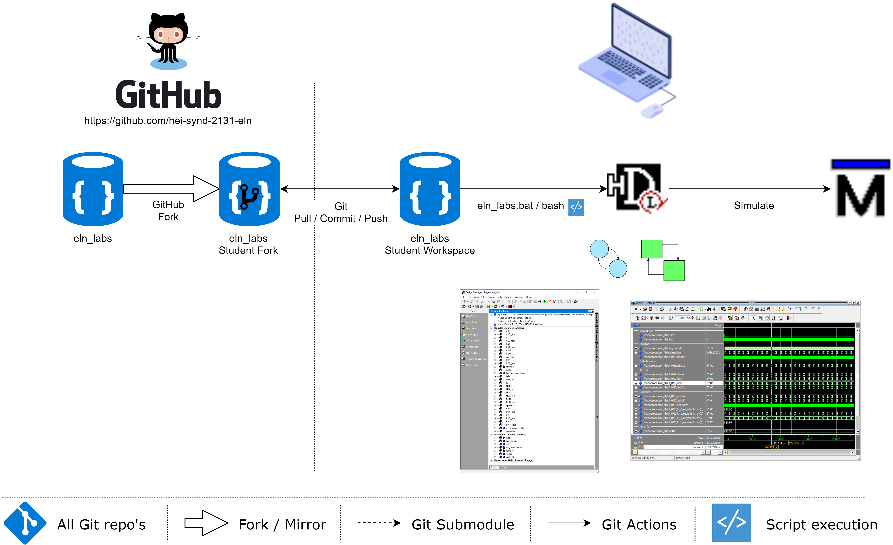

<h1 align="center">
  <br>
  
  <br>
  Hevs ELN Kart Summerschool Project - Adapted for the new [EBS3 Igloo board](https://gitlab.hevs.ch/course/ElN/fpga-ebs3)
  <br>
</h1>

<h4 align="center">Labor Files for ELN Kart Summerschool Project see also: <a href="https://cyberlearn.hes-so.ch/" target="_blank">Moodle Cyberlearn</a>.</h4>

# Table of contents
<p align="center">
  <a href="#description">Description</a> •
  <a href="#how-to-use">How To Use</a> •
  <a href="#credits">Credits</a> •
  <a href="#license">License</a> •
  <a href="#find-us-on">Find us on</a>
</p>

<div align="center">

</div>

## Description
[(Back to top)](#table-of-contents)

Laboratory file for summerschool project kart bachelor students.

As it changes each year, all you have to do is search on <a href="https://cyberlearn.hes-so.ch" target="_blank">Moodle Cyberlearn</a> for the course number and select the one starting with the last two digits of the current year.

Course number:
* ETE is 8132
* SYND is 2131

The course full name is composed as a concatenation of year (YY), school name, course ID and course name:
* Moodle ETE: "YY_HES-SO-VS_8132_Electricite 1 / Elektrotechnik 1 - ELN"
* Moodle SYND: "YY_HES-SO-VS_2131_Electricite / Elektrotechnik ELN"

## How To Use
[(Back to top)](#table-of-contents)

To clone and run this application, you'll need [Git](https://git-scm.com) and [HDL Designer](https://www.mentor.com/products/fpga/hdl_design/hdl_designer_series/) as well as [Modelsim](https://www.mentor.com/products/fv/modelsim/) installed on your computer. From your command line:



### Launch
```bash
# Change to location for the Sourcecode on your PC for Example Base of Drive U:
U:

# Clone this repository
git clone https://github.com/hei-synd-2131-eln/eln-kart.git

# Go into the repository
cd eln-kart

# Run the app
## Linux
kart.bash
## Windows
kart.bat
```

### Update Student **Fork** to the latest modification from **Master** Repo
```bash
# goto your student fork repo location
cd u:\eln_kart\

# add upstream Master remote
git remote add upstream https://github.com/hei-synd-2131-eln/eln-kart.git

# like "git pull" which is fetch + merge)
git fetch upstream
git merge upstream/master master

# Push the changes into your own fork repo
git push origin master
```

## Credits
[(Back to top)](#table-of-contents)
* COF
* PRC
* ZAS
* AMA

## License
[(Back to top)](#table-of-contents)

:copyright: [All rights reserved](LICENSE)

---

## Find us on
> [hevs.ch](https://www.hevs.ch) &nbsp;&middot;&nbsp;
> Facebook [@hessovalais](https://www.facebook.com/hessovalais) &nbsp;&middot;&nbsp;
> Twitter [@hessovalais](https://twitter.com/hessovalais) &nbsp;&middot;&nbsp;
> LinkedIn [HES-SO Valais-Wallis](https://www.linkedin.com/groups/104343/) &nbsp;&middot;&nbsp;
> Youtube [HES-SO Valais-Wallis](https://www.youtube.com/user/HESSOVS)
